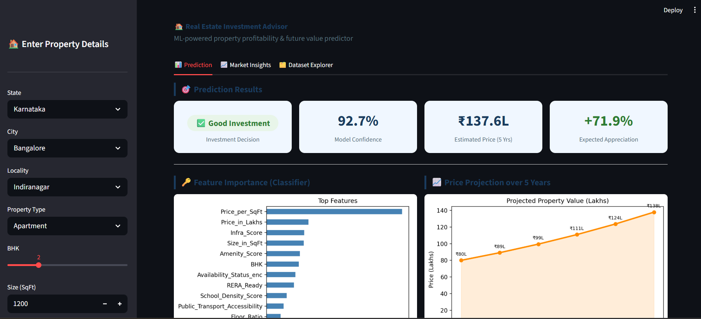
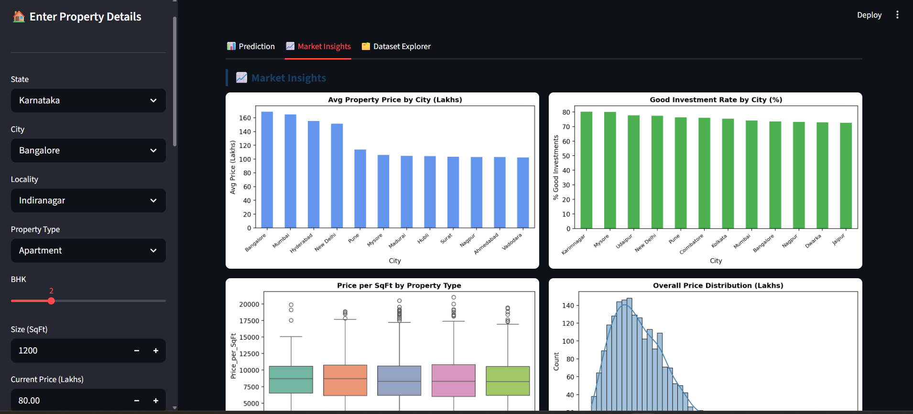
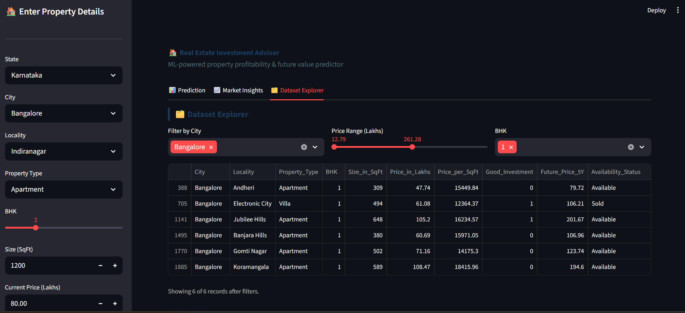

A Machine Learning powered end-to-end application that helps users predict property prices and analyze investment risks. This project uses a complete pipeline from data generation to a live interactive dashboard.

## 🚀 Project Overview
This project is designed to assist real estate investors by providing data-driven insights. It includes a full machine learning pipeline that handles data preprocessing, model training, and performance logging using MLflow.

### Key Features:
- **Price Prediction:** Predicts property values based on features like area, location quality, and property age.
- **Risk Assessment:** Uses a Random Forest Classifier to categorize investment risks.
- **Interactive Dashboard:** A user-friendly Streamlit interface for real-time predictions.
- **Experiment Tracking:** MLflow integration for monitoring model metrics (AUC, RMSE).

## 🛠️ Tech Stack
- **Language:** Python 3.x
- **Libraries:** Pandas, NumPy, Scikit-Learn, Matplotlib, Seaborn
- **ML Ops:** MLflow
- **Frontend:** Streamlit

### 📊 Project Dashboard
Here are the different views of the application:

#### 1. Price Prediction Tab


#### 2. Investment Insights Tab


#### 3. Data Analysis Tab



## 📂 Project Structure
```text
├── app.py              # Streamlit dashboard script
├── run_pipeline.py     # Main script to run the entire ML pipeline
├── train_models.py     # Logic for training Regressors and Classifiers
├── preprocess.py       # Data cleaning and feature engineering
├── generate_data.py    # Script to generate/load raw data
├── models/             # Saved .pkl model files
├── data/               # Raw and processed datasets
└── requirements.txt    # List of dependencies
